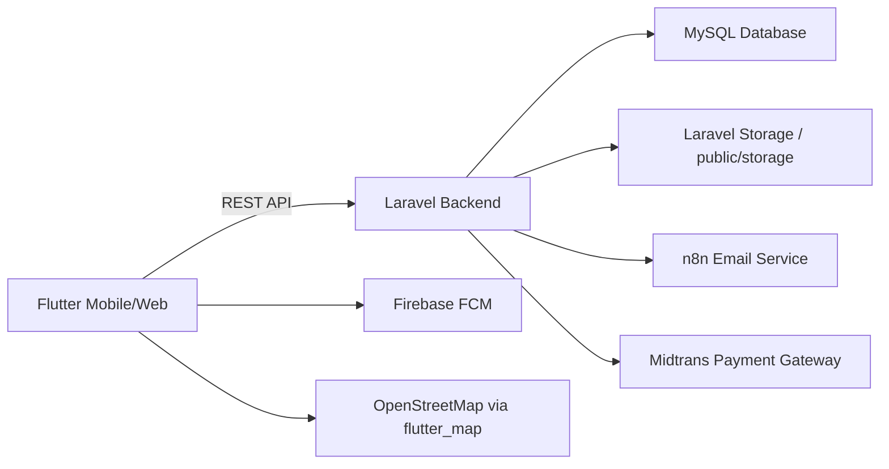

# TailorLX

**TailorLX** adalah aplikasi marketplace jasa permak dan jahit pakaian yang menghubungkan customer dengan mitra penjahit terdekat. Aplikasi ini mendukung pemesanan layanan, tracking pesanan, pembayaran digital, chat antar pengguna, dan ulasan setelah layanan selesai.

  

## Profil & Pengenalan Aplikasi

TailorLX dirancang sebagai solusi digital untuk marketplace jasa permak dan jahit. Aplikasi ini memudahkan pengguna untuk:

- menemukan penjahit lokal yang menyediakan layanan permak, jahit, dan perbaikan pakaian,
- melakukan pemesanan secara online,
- memantau status pengerjaan,
- berkomunikasi langsung dengan penjahit melalui chat,
- memberikan ulasan setelah pekerjaan selesai.

Sistem ini mendukung dua peran utama: customer yang membutuhkan layanan jahit, dan mitra penjahit yang menerima pesanan dan mengelola bisnis jahit mereka.

## Fitur Utama

### Untuk Customer
- Daftar dan login sebagai pelanggan.
- Cari penjahit berdasarkan lokasi dan layanan.
- Lihat profil penjahit lengkap dengan rating, portofolio, dan alamat.
- Buat pesanan permak atau jahit dengan detail layanan.
- Tinjau estimasi harga dan pilih jadwal pengerjaan.
- Kelola alamat dengan bantuan peta.
- Simpan penjahit favorit.
- Lihat riwayat pesanan dan status terbaru.
- Chat langsung dengan penjahit untuk koordinasi.
- Ubah foto profil.

### Untuk Mitra Penjahit
- Daftar dan login sebagai penjahit.
- Kelola profil toko dan layanan yang ditawarkan.
- Unggah portofolio hasil jahitan.
- Terima atau tolak pesanan masuk.
- Perbarui status pengerjaan pesanan.
- Lihat ringkasan dashboard pesanan.
- Terima notifikasi saat ada pesanan baru.

## Tampilan Aplikasi

> Placeholder screenshot: silakan isi dengan gambar asli nanti.

- **Login**
  
- **Beranda**
  
- **Pencarian Penjahit**
  
- **Detail Profil Penjahit**
  
- **Pemesanan**
  
- **Chat**
  
- **Profil**
  

## Cara Penggunaan

### Alur untuk Customer
1. Daftar dan buat akun customer.
2. Login ke aplikasi.
3. Cari penjahit dengan layanan yang dibutuhkan.
4. Buka profil penjahit dan lihat portofolio.
5. Buat pesanan dengan detail produk dan jadwal pengerjaan.
6. Konfirmasi pesanan dan tunggu respon penjahit.
7. Chat dengan penjahit jika perlu klarifikasi.
8. Pantau status pesanan sampai selesai.
9. Berikan ulasan setelah pesanan selesai.

### Alur untuk Mitra Penjahit
1. Daftar dan pilih peran penjahit.
2. Login ke aplikasi.
3. Lengkapi profil toko dan layanan yang tersedia.
4. Terima atau tolak pesanan masuk.
5. Update progres pengerjaan pesanan.
6. Respon chat pelanggan saat dibutuhkan.
7. Kelola daftar pesanan dan lihat ringkasan dashboard.

## Infrastruktur & Arsitektur Sistem

TailorLX memiliki arsitektur terpisah antara frontend dan backend:

- **Frontend**: Flutter untuk mobile dan web.
- **Backend**: Laravel API dengan autentikasi Sanctum.
- **Database**: MySQL.
- **Notifikasi email**: integrasi n8n.
- **Push notification**: Firebase FCM.
- **Pembayaran**: Midtrans.
- **Peta**: `flutter_map` menggunakan OpenStreetMap.

### Diagram Arsitektur



## Instalasi & Setup Teknis

### Requirement
- PHP 8.1+
- Composer
- Flutter SDK 3.x
- MySQL
- Node.js (opsional)

### Setup Backend

```bash
cd backend
composer install
cp .env.example .env
php artisan key:generate
```

Edit file `.env` untuk mengatur database dan layanan:

```env
DB_CONNECTION=mysql
DB_HOST=127.0.0.1
DB_PORT=3306
DB_DATABASE=tailorlx
DB_USERNAME=root
DB_PASSWORD=
```

Kemudian jalankan:

```bash
php artisan migrate --seed
php artisan storage:link
php artisan serve --host=127.0.0.1 --port=8000
```

### Setup Frontend

```bash
cd frontend
flutter pub get
```

Untuk menjalankan aplikasi mobile:

```bash
flutter run
```

Untuk menjalankan aplikasi web:

```bash
flutter run -d chrome
```

### Build Web dan Deploy ke Laravel

Setelah build frontend web selesai, salin hasilnya ke `backend/public`:

```bash
cd frontend
flutter build web
robocopy "build\web" "..\backend\public" /E /XD storage /XF index.php .htaccess
```

Pastikan `backend/public/index.php`, `backend/public/.htaccess`, dan `backend/public/storage` tetap ada.

## Struktur Folder

### `backend/`
- `app/` - kode Laravel utama (Controllers, Models, Services)
- `config/` - konfigurasi aplikasi
- `database/` - migrations, seeders, schema
- `public/` - entry point Laravel, hasil build Flutter Web, public storage
- `resources/views/` - Blade views dashboard admin
- `routes/` - rute API dan web admin

### `frontend/`
- `lib/` - kode sumber Flutter
- `android/`, `ios/`, `web/` - platform spesifik
- `pubspec.yaml` - dependency Flutter
- `build/` - hasil build Flutter Web

## Kontributor
- **Nama Anggota:** [Nama Anggota Kelompok di sini]

> Ganti placeholder nama dengan anggota kelompok Anda.
